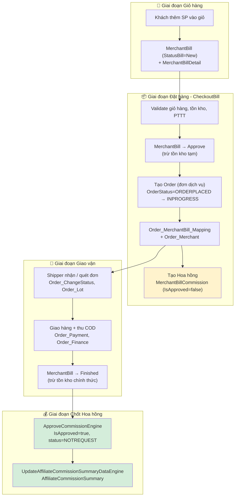

# 📑 Báo cáo nghiệp vụ: Đơn hàng & Hoa hồng

> **Phạm vi:** Nghiệp vụ Đơn hàng (Order / MerchantBill) và Hoa hồng CTV (Affiliate Commission) của nền tảng CoShare (Alliance Middleman).
> **Nguồn:** Phân tích trực tiếp từ source code `.NET 9` (module `Merchant/`, `Base/`), entities EF Core và schema PostgreSQL.
> **Ngày tạo:** 2026-08-10 · **Loại tài liệu:** Business Report (living document)

---

## 1. Mục đích báo cáo

Tài liệu này mô tả **luồng nghiệp vụ end-to-end** từ lúc khách mua hàng đến lúc chi trả hoa hồng cho cộng tác viên (CTV / Affiliate), bao gồm:

- Cách một **đơn hàng** được hình thành: `MerchantBill` (hóa đơn/giỏ hàng) → `Order` (đơn dịch vụ) → giao vận (Shipper).
- Cách **hoa hồng** được tính, ghi nhận và duyệt: `MerchantBillCommission`, cây `AffiliatePartnerClosure`, bậc `ConfigAffiliateLevel`, tỉ lệ `ConfigMaterialCommisionTier`.
- Toàn bộ **các bảng liên quan** và quan hệ giữa chúng.

## 2. Cấu trúc thư mục

| File | Nội dung |
|------|----------|
| [00-README.md](00-README.md) | Tổng quan, thuật ngữ, sơ đồ tổng thể (file này) |
| [01-NghiepVu-DonHang.md](01-NghiepVu-DonHang.md) | Nghiệp vụ **Đơn hàng**: MerchantBill → Order, vòng đời trạng thái, thanh toán, giao vận |
| [02-NghiepVu-HoaHong.md](02-NghiepVu-HoaHong.md) | Nghiệp vụ **Hoa hồng**: công thức tính, cây affiliate, duyệt, tổng hợp |
| [03-CacBang-VaQuanHe.md](03-CacBang-VaQuanHe.md) | **Các bảng liên quan** + ERD + trạng thái/enum |

## 3. Bức tranh tổng thể (Big picture)

## 4. Ba trục dữ liệu chính

| Trục | Bảng gốc | Vai trò |
|------|----------|---------|
| **Hóa đơn (Bill)** | `MerchantBill` + `MerchantBillDetail` | Giỏ hàng → hóa đơn bán của Merchant. Là "nguồn sự thật" cho tiền hàng & tồn kho. |
| **Đơn dịch vụ (Order)** | `Order` + `Order_Merchant` + `Order_MerchantBill_Mapping` | Đối tượng giao vận, gắn Shipper (Owner), theo dõi trạng thái giao hàng. |
| **Hoa hồng (Commission)** | `MerchantBillCommission` + `AffiliateCommissionSummary` | Hoa hồng cho CTV theo cây giới thiệu, gắn với từng Bill. |

## 5. Thuật ngữ (Glossary)

| Thuật ngữ | Ý nghĩa |
|-----------|---------|
| **Renter / Customer** | Khách hàng đặt mua (`MerchantBill.RenterGUID`). |
| **Merchant** | Cửa hàng bán (`MerchantBill.MerchantGUID`). |
| **Owner / Shipper** | Người giao hàng. Trong module Merchant, "Owner" là chủ đơn giao. |
| **CTV / Affiliate** | Cộng tác viên trong hệ thống giới thiệu đa cấp (`AffiliatePartner`). |
| **Bill** | Hóa đơn `MerchantBill` — cũng đóng vai trò giỏ hàng khi `StatusBill = New`. |
| **Order** | Đơn dịch vụ `Order` — đối tượng để giao vận, khác với Bill. |
| **Direct / Indirect** | Hoa hồng trực tiếp (CTV chính là người bán) / gián tiếp (tuyến trên). |
| **Level Cap** | Số bậc tối đa của cây hoa hồng (mặc định **3**). |
| **Tier** | Tỉ lệ % hoa hồng theo (nhóm hàng × bậc CTV) — `ConfigMaterialCommisionTier`. |

## 6. Quy ước quan trọng cần lưu ý

- ⚠️ **Bill ≠ Order.** `MerchantBill` là hóa đơn bán hàng; `Order` là đơn giao vận. Chúng liên kết qua `Order_MerchantBill_Mapping`.
- ⚠️ **Không có transaction bao trùm** trong luồng `CheckoutBill` — mỗi thao tác repository là atomic riêng lẻ (xem [01](01-NghiepVu-DonHang.md#rủi-ro--lưu-ý)).
- ⚠️ **Hoa hồng tính trên người giới thiệu của khách hàng** (cây `AffiliatePartnerClosure` theo `DescendantUserId = customerUser.Id`), **không phải** trực tiếp trên người bán.
- ⚠️ Tồn kho trừ theo **2 mốc**: tạm thời khi `Approve`, chính thức khi `Finished` (xem enum `eMerchantBillStatus`).

---

> Xem chi tiết từng nghiệp vụ trong các file kế tiếp.
