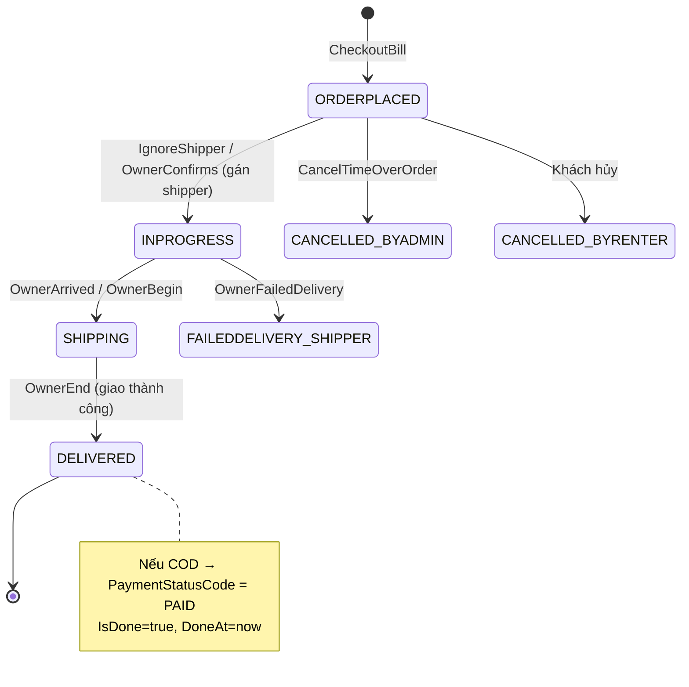
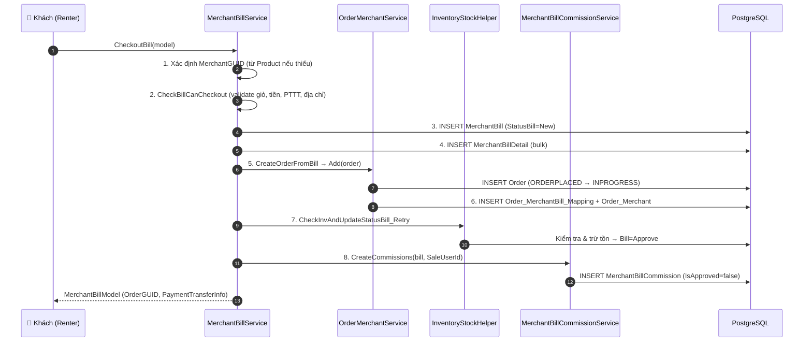

# 📦 Nghiệp vụ Đơn hàng (Đơn hàng / Order)

> **Module:** `Merchant/` (chính), `Base/` (khung Order), `Shipper/` (view giao vận).
> **Ngày:** 2026-08-10 · Phân tích trực tiếp từ source code.

Xem thêm: [00-README](00-README.md) · [Hoa hồng](02-NghiepVu-HoaHong.md) · [Các bảng](03-CacBang-VaQuanHe.md)

---

## 1. Hai khái niệm cốt lõi: Bill vs Order

Hệ thống tách bạch **hai thực thể** khác nhau, dễ nhầm lẫn:

| | `MerchantBill` (Hóa đơn) | `Order` (Đơn dịch vụ) |
|---|---|---|
| **Bản chất** | Hóa đơn bán hàng của Merchant; đồng thời là **giỏ hàng** khi `StatusBill=New` | Đơn giao vận, đối tượng để gắn Shipper (Owner) |
| **Khóa chính** | `Id` / `ID_GUID` | `Id` / `ID_GUID` |
| **Chi tiết** | `MerchantBillDetail` (từng sản phẩm) | Không có detail sản phẩm; tham chiếu ngược về Bill |
| **Tiền** | `TotalMoney` (tiền hàng) | `TotalPrice`, `SubTotal`, `ServiceFee`, `DiscountMoney`… (gồm phí giao) |
| **Trạng thái** | `StatusBill` (int enum) | 3 trục: Order / Owner / Renter status (string code) |
| **Liên kết** | qua `Order_MerchantBill_Mapping` | qua `Order_MerchantBill_Mapping` + `Order_Merchant` |

> Một `Order` gom **một hoặc nhiều** `MerchantBill` qua bảng nối `Order_MerchantBill_Mapping`.

## 2. Vòng đời hóa đơn — `eMerchantBillStatus`

Enum tại [MerchantBillModel.cs:158](../../../Merchant/AllianceMiddlemanWebAPI.Service/Models/MainBusiness/MerchantBillModel.cs#L158):

| Giá trị | Tên | Ý nghĩa nghiệp vụ | Tồn kho |
|:---:|-----|-------------------|---------|
| `0` | **New** | Phiếu nháp = giỏ hàng đang mua | ❌ không tính tồn |
| `1` | **Approve** | Đã xác nhận đặt hàng (checkout thành công) | ➖ **trừ tồn kho tạm thời** |
| `2` | **Finished** | Đã giao hàng hoàn tất | ➖ **trừ tồn kho chính thức** |
| `3` | **Cancel** | Phiếu bị hủy | ✅ không trừ tồn |

## 3. Vòng đời đơn dịch vụ — 3 trục trạng thái

`Order` mang **3 trục trạng thái song song** (mỗi trục là một cột `*StatusCode` riêng), cùng tra cứu từ bảng `ConfigOrderStatus` (phân biệt bằng cờ `UseForOrder` / `UseForOwner` / `UseForRenter`):

- **Order axis** — `OrderStatusCode` (trạng thái tổng thể đơn)
- **Owner axis** — `OwnerStatusCode` (trạng thái phía Shipper)
- **Renter axis** — `StatusCode` / `RenterStatusCode` (trạng thái hiển thị cho khách)

### 3.1 Danh mục mã trạng thái

Định nghĩa tại [MiddlemanOrderStatus.cs](../../../Base/AllianceMiddlemanBase.DataShared/Common/MiddlemanOrderStatus.cs) và [OrderStatusCodes.cs](../../../Merchant/AllianceMiddlemanWebAPI.DataShared/Common/OrderStatusCodes.cs):

| Nhóm | Mã | Ý nghĩa |
|------|-----|---------|
| **Base/Order** | `ORDERPLACED` | Đơn vừa được đặt |
| | `INPROGRESS` | Đang xử lý |
| | `SHIPPING` | Đang giao |
| | `DELIVERED` | Đã giao |
| | `CANCELLED_BYRENTER` / `CANCELLED_BYADMIN` | Hủy bởi khách / admin |
| **Owner (Shipper)** | `PICKUPED_SHIPPER` | Shipper đã nhận/lấy hàng |
| | `READYTODELIVERY_SHIPPER` | Sẵn sàng giao |
| | `DELIVERING_SHIPPER` | Đang trên đường giao |
| | `SHIPPED_SHIPPER` | Đã giao xong |
| | `FAILEDDELIVERY_SHIPPER` | Giao thất bại |
| | `NOTPICKUP_SHIPPER` / `NOTDELIVERY` / `CANCELLED` | Chưa lấy / chưa giao / hệ thống hủy |
| **Renter** | `READYTORECEIVE` | Sẵn sàng nhận hàng |
| **Merchant** | `MERCHANTCONFIRM` / `MERCHANTCANCEL` | Merchant xác nhận / hủy |
| | `WAITINGOWNER2CONFIRM` / `ORDERDONE` | Chờ Shipper xác nhận / hoàn tất |
| **Order_Lot** | `NOTDELIVERY`, `READYTORECEIVE`, `DELIVERING_BATCH`, `SHIPPED_BATCH`, `COMPLETED_BATCH` | Trạng thái lô hàng |
| **Payment** | `UNPAID`, `WAIT4PAYMENT`, `PAID` | Trạng thái thanh toán |

### 3.2 Sơ đồ chuyển trạng thái (giao vận)

Nguồn chuyển trạng thái: [OrderBaseService_UserAction_Owner.cs](../../../Base/AllianceMiddlemanBase.Shared/Services/MainBusiness/Order/OrderBaseService_UserAction_Owner.cs) — các action `OwnerConfirms`, `OwnerArrived`, `OwnerReady2Ship`, `OwnerBegin`, `OwnerEnd`, `OwnerFailedDelivery`. Mỗi lần đổi trạng thái ghi 1 dòng vào `Order_ChangeStatus` (cột `UserCode` = `"Order"`/`"Owner"`/`"Renter"`) qua `RentalServiceHelper.InsertOrder_ChangeStatus`.

## 4. Luồng tạo đơn từ hóa đơn (CheckoutBill)

`POST api/v1/MerchantBill/CheckoutBill` → `MerchantBillService.CheckoutBill()`. Tóm tắt 8 bước (chi tiết đầy đủ trong [BF-MER-001-CheckoutBill](../../ProjectAnalysis/BusinessFlows/Merchant/BF-MER-001-CheckoutBill.md)):

### Chi tiết tạo `Order` — [OrderMerchantBaseService_CreateOrder.cs](../../../Merchant/AllianceMiddlemanWebAPI.Service/Services/MainBusiness/OrderMerchant/OrderMerchantBaseService_CreateOrder.cs)

`AddFromBill()` (dòng 39) và `CreateOrderFromBill` trong MerchantBillService dựng entity `Order` với:

- `OrderNumber` = mã random; `EntDate`, `RenterId/RenterID_GUID/RenterName/RenterPhoneNumber`, `RenterReceiverName/Phone`.
- Tiền: `TotalPrice`, `TotalOriginalPrice`, `SubTotal = TotalOriginalPrice - PromotionMoney`, `ServiceFee` (phí giao), `DiscountMoney`, `AmountRemain = TotalPrice`.
- `OrderStatusCode` = `INPROGRESS` nếu `setting.IgnoreShipperWhenOrder`, ngược lại `ORDERPLACED` (đường MerchantBillService, dòng ~572).
- `PaymentStatusCode`: **`WAIT4PAYMENT`** nếu PTTT = `CREDIT`, ngược lại **`UNPAID`**.

`ActionAfterCreateOrder_Ext()` (dòng 300):
- Tạo **`Order_MerchantBill_Mapping`**: nối `OrderId/OrderGUID` ↔ `BillId/BillGUID`, kèm địa chỉ/tọa độ Merchant, `TotalMoney`; `StatusCode` lấy từ `ConfigOrderMerchantStatus` mặc định.
- Tạo **`Order_Merchant`**: `DeliveryFee/DeliveryDistance/DeliveryTime`, `MerchantDiscountMoney`, `HubDeliveryAddressId`, kèm `Order_Merchant_Address` (địa chỉ giao của khách).
- Tạo **`Order_Finance`** (qua base `CreateOrder`): các mốc lợi nhuận/hoàn tiền dự kiến.

## 5. Luồng Shipper (Owner) xác nhận & giao hàng

`OwnerConfirms()` — [OrderBaseService_UserAction_Owner.cs:452](../../../Base/AllianceMiddlemanBase.Shared/Services/MainBusiness/Order/OrderBaseService_UserAction_Owner.cs#L452):

- **Cổng chặn** `CheckOwnerCanConfirm` (dòng 245): từ chối nếu đơn đã done/cancel/đã có owner, hoặc PTTT = `TRANS` mà `PaymentStatusCode != PAID` ("Đơn chưa được thanh toán").
- **Gán Shipper mới**: yêu cầu role `Shipper`, gọi `SetOwnerToOrder` (ghi `OwnerId/OwnerID_GUID/OwnerName/OwnerPhoneNumber`), đặt Owner→`PICKUPED_SHIPPER`, Order→`INPROGRESS`, thêm dòng `Order_LogOwner` (accepted).
- **Merchant override** `ActionAfterOwnerConfirm`: đưa `Order_MerchantBill_Mapping` → `INPROGRESS`, **gom đơn vào `Order_Lot`** theo `HubDeliveryAddressId`, tính lại COD của lô (`sp_Recalculate_OrderLot_COD_Json_Run`).

Chuỗi action giao vận tiếp theo: `OwnerArrived` → `OwnerReady2Ship` → `OwnerBegin` → `OwnerEnd` (khi hoàn tất: Owner→`SHIPPED_SHIPPER`, Order→`DELIVERED`, `IsDone=true`, và nếu COD thì `PaymentStatusCode=PAID`).

> ℹ️ **`OrderShipper` không phải là bảng.** Trong module Shipper, `OrderShipperService` là một service *view trên chính bảng `Order`* (`EFBaseCategoryService<Order, OrderShipperModel, …>`), lọc `!IsCancel && !IsDone` theo `OwnerID_GUID`.

## 6. Thanh toán — Payment

| Loại (`ePaymentTypeCodes`) | Mô tả | Trạng thái khởi tạo |
|------|-------|---------------------|
| `COD` | Thu tiền khi giao | `UNPAID` → `PAID` khi `OwnerEnd` |
| `TRANS` | Chuyển khoản | `UNPAID`; phải `PAID` mới cho Shipper xác nhận |
| `CREDIT` | Trả chậm (hạn mức) | `WAIT4PAYMENT` (kiểm tra hạn mức khi checkout) |

- Enum trạng thái: `ePaymentStatusCode { WAIT4PAYMENT, UNPAID, PAID }` ([ConfigPaymentTypeInfo.cs](../../../Base/AllianceMiddlemanBase.Core/DataInfo/ConfigPaymentTypeInfo.cs)).
- Bảng `Order_Payment` ghi các giao dịch ví thực tế (hoàn tiền tài xế, tài xế nộp phí…): `PaymentAction`, `Amount`, `WalletFrom/To`, `IsApproved`, `IsSuccessful`.
- COD theo lô: `Order_Lot.TotalCODAmount` / `CollectedCODAmount` / `SubmittedCODAmount` / `ApprovedCODAmount`.

## 7. Rủi ro & Lưu ý

| Vấn đề | Mô tả | Nguồn |
|--------|-------|-------|
| ⚠️ **Không có transaction bao trùm** | `CheckoutBill` thực hiện nhiều INSERT rời rạc; lỗi giữa chừng có thể để lại Bill nhưng thiếu Order | [BF-MER-001 §9](../../ProjectAnalysis/BusinessFlows/Merchant/BF-MER-001-CheckoutBill.md) |
| ⚠️ **Race condition tồn kho** | `CheckInvAndUpdateStatusBill_Retry` có retry nhưng vẫn rủi ro oversell khi tải cao | PERF-001 |
| ⚠️ **Refresh cache tồn kho mỗi request** | `MerchantProductInventorys_Refresh()` reload toàn bộ sau mỗi checkout | MerchantBillService |
| ⚠️ **3 trục trạng thái** dễ lệch nhau nếu action không cập nhật đồng bộ cả Order/Owner/Renter | — | OrderBaseService_UserAction_Owner |

---

> Tiếp theo: [Nghiệp vụ Hoa hồng →](02-NghiepVu-HoaHong.md)
