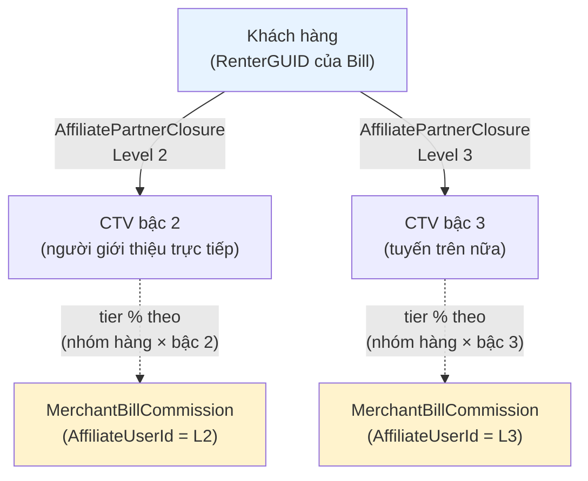
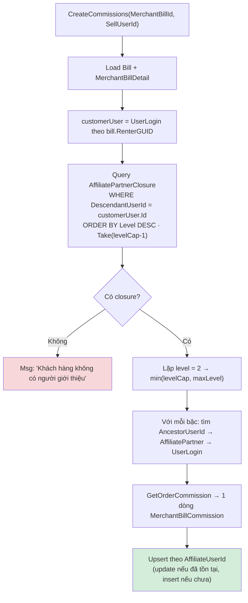
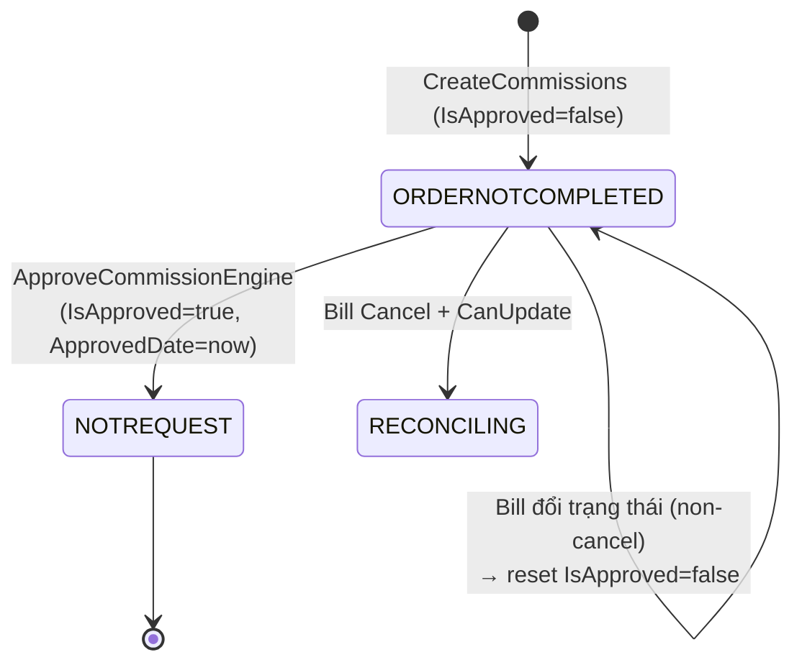
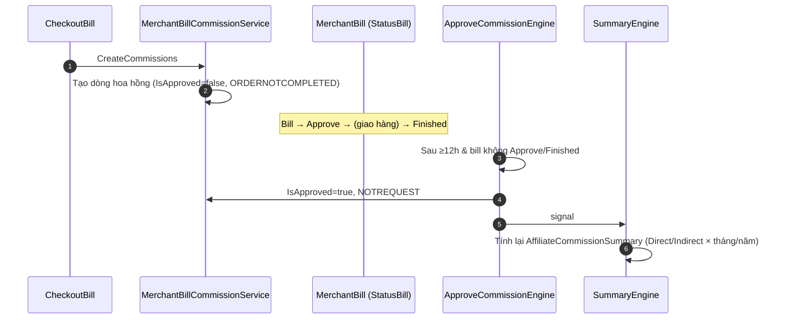

# 💰 Nghiệp vụ Hoa hồng (Commission / Affiliate)

> **Module:** `Merchant/` (tính & duyệt hoa hồng), `Base/` (cây affiliate, bậc, tỉ lệ).
> **Ngày:** 2026-08-10 · Phân tích trực tiếp từ source code.

Xem thêm: [00-README](00-README.md) · [Đơn hàng](01-NghiepVu-DonHang.md) · [Các bảng](03-CacBang-VaQuanHe.md)

---

## 1. Mô hình hoa hồng đa cấp (multi-level)

CoShare vận hành chương trình **CTV giới thiệu đa cấp**. Khi một khách hàng mua hàng, hệ thống **truy ngược cây giới thiệu** của khách đó và chia hoa hồng cho các CTV **tuyến trên** theo từng bậc.



- Số bậc tối đa (**Level Cap**) mặc định = **3** — lấy từ config `SYSTEM_AFFILIATE_PARTNER_SETTING` ([AffiliatePartnerHelper.cs:42](../../../Base/AllianceMiddlemanBase.Shared/Helper/AffiliatePartnerHelper.cs#L42)).
- ⚠️ **Bậc 1 (trực tiếp) hiện đang bị comment** trong code tạo hoa hồng — thực tế chỉ sinh hoa hồng cho bậc **2 → levelCap** ([MerchantBillCommissionService.cs:136-146, 160](../../../Merchant/AllianceMiddlemanWebAPI.Service/Services/MainBusiness/MerchantBillCommission/MerchantBillCommissionService.cs#L136)).

## 2. Bốn bảng cấu hình nền tảng

| Bảng | Vai trò | Trường then chốt |
|------|---------|------------------|
| `AffiliatePartner` | Hồ sơ CTV | `UserLoginId`, `ReferralCode`, `ReferredByCode`, `ReferredByUserId` |
| `AffiliatePartnerClosure` | **Cây quan hệ** (closure table) | `AncestorUserId`, `DescendantUserId`, `Level`, `AffiliateLevelId` |
| `ConfigAffiliateLevel` | Danh mục **bậc CTV** | `Level` (1,2,3…), `Code`, `Name`, `IsApplyInOrder` |
| `ConfigMaterialCommisionTier` | **Tỉ lệ %** theo (nhóm hàng × bậc) | `MaterialCommGroupId`, `AffiliateLevelId`, **`CommPercent`** |

### 2.1 Closure table hoạt động thế nào?

`AffiliatePartnerClosure` lưu **mỗi cặp (tổ tiên, hậu duệ) ở từng bậc** làm một dòng. Ví dụ nếu D được C giới thiệu, C được B giới thiệu:

| AncestorUserId | DescendantUserId | Level |
|:---:|:---:|:---:|
| C | D | 2 |
| B | D | 3 |

- Được sinh **tại thời điểm đăng ký** qua stored function `sp_Insert_AffiliatePartnerClosure_Json`, gọi từ `MiddlemanAccountService.InsertAffiliateClosures(user, referredByCode)`. SP lặp `CurrentLevel = 2..AffiliateLevelCap`, đi ngược lên qua `ReferredByCode` của mỗi tổ tiên.
- Cho phép "re-parent" hậu duệ qua `AffiliatePartnerClosureService.UpdateAffiliatePartnerClosure`.

### 2.2 Tỉ lệ hoa hồng — Tier

Một `ConfigMaterialCommisionTier` = **% cho một cặp (nhóm hàng hoa hồng `MaterialCommGroupId`, bậc CTV `AffiliateLevelId`)**.

- Sản phẩm `MerchantProduct` thuộc một `MaterialCommGroupId`.
- Bậc lấy từ vị trí CTV trong closure.
- Khóa tra cứu (cache): `$"{MaterialCommGroupId}_{Level}"` — xem [CachedDataManagement_ConfigMaterialCommisionTier.cs:42](../../../Base/AllianceMiddlemanBase.Core/DataInfo/Cached/CachedDataManagement_ConfigMaterialCommisionTier.cs#L42).

## 3. Công thức tính hoa hồng

Hàm `GetOrderCommission(bill, affiliateUser, currentLevelInfo, billDetails)` — [MerchantBillCommissionService.cs:234](../../../Merchant/AllianceMiddlemanWebAPI.Service/Services/MainBusiness/MerchantBillCommission/MerchantBillCommissionService.cs#L234):

```
Với mỗi dòng hàng (MerchantBillDetail) trong hóa đơn:
    tierCode         = $"{product.MaterialCommGroupId}_{affiliateLevel}"
    tier             = ConfigMaterialCommisionTier_Get_Instance_Code(tierCode)
    CommissionPercent = tier.CommPercent
    CommissionAmount  = ROUND( detail.TotalPrice × (CommissionPercent / 100) )

CommisionAmount (của 1 CTV trên 1 Bill) = Σ CommissionAmount tất cả các dòng
CommisionPercent = chỉ set khi hóa đơn có đúng 1 dòng hàng
CommisionDetails = JSON mảng OrderCommissionDetailsInfo (chi tiết từng dòng)
```

`OrderCommissionDetailsInfo` (JSON) gồm: `OrderDetailId`, `MaterialId`, `TotalPrice`, `CommissionPercent`, `CommissionAmount`.

> **Điểm mấu chốt:** tỉ lệ được chọn **theo từng dòng hàng** (nhóm hàng của sản phẩm) × **theo bậc của CTV**. Nếu không tìm thấy tier phù hợp → dòng đó có hoa hồng = 0.

## 4. Luồng tạo hoa hồng — `CreateCommissions`

Gọi từ bước 8 của CheckoutBill ([MerchantBillCommissionService.cs:111](../../../Merchant/AllianceMiddlemanWebAPI.Service/Services/MainBusiness/MerchantBillCommission/MerchantBillCommissionService.cs#L111)):



Mỗi dòng `MerchantBillCommission` được tạo với:
- `AffiliateUserId` = CTV tuyến trên **nhận** hoa hồng, `AffiliateLevel`/`AffiliateLevelId` = bậc.
- `SellUserId` = user khách của bill (`bill.RenterGUID`).
- `CommisionAmount`, `CommisionDetails`, snapshot `MerchantBillTotalMoney` / `MerchantBillDate`.
- `IsApproved = false`, `CommPaymentStatusId = ORDERNOTCOMPLETED`.

## 5. Vòng đời trạng thái hoa hồng

Không có enum `eMerchantBillCommissionStatus`. Trạng thái được mô hình bằng **cờ `IsApproved` (bool)** + **`CommPaymentStatusCodes` (string)** lưu ở `CommPaymentStatusId`:

| Mã (`CommPaymentStatusCodes`) | Khi nào | Nguồn |
|------|---------|-------|
| `ORDERNOTCOMPLETED` | Khởi tạo lúc tạo hoa hồng | `GetOrderCommission` |
| `RECONCILING` | Bill bị Cancel + đủ điều kiện → chờ đối soát | `UpdateComissionStatus:358` |
| `NOTREQUEST` | Khi hoa hồng được **duyệt** | `ApproveCommissionEngine` / `ApproveCommission` |
| `REJECTED` | (khai báo, chưa dùng trong luồng này) | — |



### 5.1 Điều kiện duyệt — `CanApproveCommision`

[MerchantBillHelper.cs:396](../../../Merchant/AllianceMiddlemanWebAPI.Service/Helper/MerchantBillHelper.cs#L396):
- Cần đã trôi qua ≥ `AllowApproveCommAfterHours` (**mặc định 12 giờ**) kể từ khi hóa đơn hoàn tất (`IM_ApprovedDate`).
- **VÀ** `CanUpdateCommisionStatus` = true → tức bill **KHÔNG** ở trạng thái `Approve(1)` hay `Finished(2)`.

### 5.2 `UpdateComissionStatus` khi Bill đổi trạng thái

[MerchantBillCommissionService.cs:318](../../../Merchant/AllianceMiddlemanWebAPI.Service/Services/MainBusiness/MerchantBillCommission/MerchantBillCommissionService.cs#L318):
- Bill **≠ Cancel**: đặt lại toàn bộ `IsApproved=false`, rồi signal `UpdateAffiliateCommissionSummaryDataEngine` (tính lại tổng hợp).
- Bill **= Cancel** (và `CanUpdateCommisionStatus`): đặt các dòng chưa duyệt → `RECONCILING`, signal `ApproveCommissionEngine`.

## 6. Engine nền (background)

### 6.1 `ApproveCommissionEngine`
[ApproveCommissionEngine.cs](../../../Merchant/AllianceMiddlemanWebAPI.Service/Engines/ApproveCommissionEngine.cs):
- Quét các `MerchantBill` có dòng hoa hồng **chưa duyệt** (`IsApproved != true`).
- Lọc theo `CanApproveCommision` (đủ 12h + bill không ở Approve/Finished).
- Với các dòng đủ điều kiện: đặt `IsApproved=true`, `ApprovedDate=now`, `CommPaymentStatusId=NOTREQUEST`.
- Sau đó signal `UpdateAffiliateCommissionSummaryDataEngine`.
- Vừa chạy theo timer, vừa **signal-driven** (`ProjectEngineHelper.SignalEngine`).
- > ⚠️ **Vấn đề hiệu năng đã ghi nhận**: query dùng `.Include(...).Where(Count > 0)` sinh `SELECT count(*)` cho mỗi dòng → ~2.9s/lần. Xem [MerchantBill.md §7](../../ProjectAnalysis/SystemAudit/TableAnalysis/MerchantBill.md).

### 6.2 `UpdateAffiliateCommissionSummaryDataEngine`
[UpdateAffiliateCommissionSummaryDataEngine.cs](../../../Merchant/AllianceMiddlemanWebAPI.Service/Engines/UpdateAffiliateCommissionSummaryDataEngine.cs) → gọi `UpdateAffiliateCommissionSummaryData()`.

## 7. Tổng hợp hoa hồng — `AffiliateCommissionSummary`

[SolidAffiliateCommissionSummaryService.cs:121](../../../Merchant/AllianceMiddlemanWebAPI.Service/Services/MainBusiness/AffiliateCommissionSummary/SolidAffiliateCommissionSummaryService.cs#L121):

- Đọc view `ViewMerchantBill_BillComm` cho các bill ở trạng thái `Approve(1)` hoặc `Finished(2)`.
- Gom nhóm theo `AffiliateUserId`, với mỗi CTV tính:

| Cột | Công thức |
|-----|-----------|
| `TotalDirectCommAmount` | Σ hoa hồng **Direct** (`AffiliateUserId == SellUserId`) |
| `TotalIndirectCommAmount` | Σ hoa hồng **Indirect** (`AffiliateUserId != SellUserId`) |
| `*_ThisMonth` | lọc thêm `MerchantBillDate.Month == tháng hiện tại` |
| `*_ThisYear` | lọc thêm `MerchantBillDate.Year == năm hiện tại` |

- Phân loại **Direct / Indirect**: `CommissionTypeCodes.Direct` / `.Indirect` ([OrderStatusCodes.cs:34](../../../Merchant/AllianceMiddlemanWebAPI.DataShared/Common/OrderStatusCodes.cs#L34)).
- Bảng này là **read-only view** (`IsReadOnlyView = true`) — chỉ được engine cập nhật, dùng cho màn hình thu nhập CTV.

## 8. Toàn cảnh vòng đời hoa hồng



## 9. Lưu ý nghiệp vụ quan trọng

- ⚠️ **Hoa hồng gắn với người giới thiệu của KHÁCH**, truy từ `AffiliatePartnerClosure.DescendantUserId = customerUser.Id` — không phải trực tiếp từ người bán.
- ⚠️ **Bậc 1 (direct) đang bị vô hiệu** (comment) trong `CreateCommissions`; thực tế chỉ chia từ bậc 2 trở lên.
- ⚠️ **`Direct` trong Summary** = trường hợp `AffiliateUserId == SellUserId` (CTV cũng chính là user khách của bill) — cần lưu ý ngữ nghĩa này khi đọc báo cáo thu nhập.
- ⚠️ Duyệt hoa hồng **không tức thời**: phải chờ ≥12h và bill không còn ở Approve/Finished.
- Hoa hồng bị **reset `IsApproved=false`** mỗi khi bill đổi trạng thái (trừ Cancel) → summary được tính lại.

---

> Xem thêm: [Các bảng & quan hệ →](03-CacBang-VaQuanHe.md)
