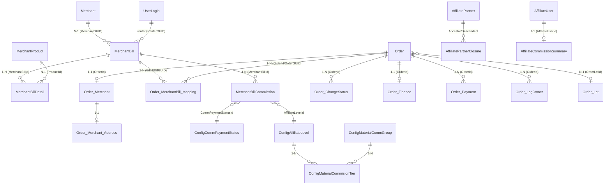

# 🗃️ Các bảng liên quan & Quan hệ

> Danh mục các bảng thuộc nghiệp vụ Đơn hàng & Hoa hồng, kèm cột chính và sơ đồ quan hệ (ERD).
> **Ngày:** 2026-08-10 · Nguồn: EF entities + [DatabaseSchema-CoShareTest.md](../../ProjectAnalysis/DatabaseSchema-CoShareTest.md).

Xem thêm: [00-README](00-README.md) · [Đơn hàng](01-NghiepVu-DonHang.md) · [Hoa hồng](02-NghiepVu-HoaHong.md)

---

## 1. Sơ đồ quan hệ tổng thể (ERD)

## 2. Nhóm bảng theo nghiệp vụ

### 2.1 Nhóm Hóa đơn (Bill)

| Bảng | Vai trò | Module |
|------|---------|--------|
| `MerchantBill` | Hóa đơn bán / giỏ hàng | Merchant |
| `MerchantBillDetail` | Chi tiết sản phẩm trong hóa đơn | Merchant |
| `MerchantBillCommission` | Hoa hồng theo hóa đơn | Merchant |

### 2.2 Nhóm Đơn hàng (Order)

| Bảng | Vai trò |
|------|---------|
| `Order` | Đơn dịch vụ (đối tượng giao vận) |
| `Order_Merchant` | Thông tin phần merchant của đơn (phí giao, giảm giá) |
| `Order_Merchant_Address` | Địa chỉ giao hàng của đơn |
| `Order_MerchantBill_Mapping` | **Bảng nối** Order ↔ MerchantBill |
| `Order_ChangeStatus` | Nhật ký đổi trạng thái |
| `Order_Finance` | Tài chính đơn (lợi nhuận, hoàn tiền dự kiến/thực tế) |
| `Order_Payment` | Giao dịch ví/thanh toán của đơn |
| `Order_LogOwner` | Nhật ký Shipper nhận/từ chối đơn |
| `Order_LookingForOwner` | Tiến trình tìm Shipper |
| `Order_Lot` | Lô hàng (gom đơn theo hub để giao & đối soát COD) |

### 2.3 Nhóm Hoa hồng / Affiliate

| Bảng | Vai trò | Module |
|------|---------|--------|
| `AffiliatePartner` | Hồ sơ CTV (mã giới thiệu) | Base/AppSystem |
| `AffiliatePartnerClosure` | Cây quan hệ đa cấp (closure table) | Base/AppSystem |
| `AffiliateCommissionSummary` | Tổng hợp hoa hồng theo CTV | Merchant |
| `ConfigAffiliateLevel` | Danh mục bậc CTV | Base/Categories |
| `ConfigMaterialCommGroup` | Nhóm hàng để gán tỉ lệ hoa hồng | Base/Categories |
| `ConfigMaterialCommisionTier` | Tỉ lệ % theo (nhóm hàng × bậc) | Base/Categories |
| `ConfigCommPaymentStatus` | Danh mục trạng thái thanh toán hoa hồng | Merchant/Categories |

## 3. Chi tiết cột — các bảng trọng tâm

### 3.1 `MerchantBill`

| Cột | Kiểu | Ý nghĩa |
|-----|------|---------|
| `Id` / `ID_GUID` | bigint / uuid | Khóa chính / khóa GUID |
| `MerchantGUID` | uuid | Cửa hàng |
| `RenterGUID` | uuid | Khách hàng |
| `ServiceOrderGUID` | uuid | Liên kết Order |
| `BillNumber` / `OrderNumber` | varchar | Mã hóa đơn / mã đơn |
| `BillDate` | timestamptz | Ngày lập |
| `StatusBill` | int | 0=New,1=Approve,2=Finished,3=Cancel |
| `TotalMoney` | numeric | Tổng tiền hàng |
| `TotalDiscountOnItem` | numeric | Tổng giảm giá theo item |
| `PaymentTypeCode` | varchar | COD / TRANS / CREDIT |
| `RenterAddress` / `RenterLat/Lng` | varchar / numeric | Địa chỉ + tọa độ giao |
| `PickupAddress` / `PickupLat/Lng` | varchar / numeric | Địa chỉ + tọa độ lấy hàng |
| `DeliveryDistance` | numeric | Khoảng cách giao |
| `RenterReceiverName/Phone` | varchar | Người nhận |
| `StatusChangedBy/Date` | bigint/timestamptz | Ai/khi nào đổi trạng thái |

### 3.2 `MerchantBillDetail`

| Cột | Kiểu | Ý nghĩa |
|-----|------|---------|
| `Id` / `ID_GUID` | bigint / uuid | Khóa |
| `MerchantBillId` | bigint | FK → MerchantBill |
| `ProductId` / `ProductName` | bigint / varchar | Sản phẩm |
| `ProductPrice` / `Quantity` | numeric | Đơn giá / số lượng |
| `TotalPrice` / `TotalMoney` | numeric | Thành tiền (dùng để tính hoa hồng) |
| `TotalPriceAttribute` | numeric | Tiền thuộc tính |
| `DiscountOnItemId/Money/Percent` | | Giảm giá theo item |
| `MaterialCommisionTiers` | varchar | Snapshot tier hoa hồng lúc thêm vào giỏ |
| `AttributeDataJson` | varchar | Thuộc tính đã chọn (JSON) |

### 3.3 `MerchantBillCommission`

| Cột | Kiểu | Ý nghĩa |
|-----|------|---------|
| `Id` / `ID_GUID` | bigint / uuid | Khóa |
| `MerchantBillId` / `MerchantBillID_GUID` | bigint / uuid | FK → Bill |
| `SellUserId` | bigint | User khách của bill (dùng phân loại Direct/Indirect) |
| `AffiliateUserId` | bigint | **CTV nhận** hoa hồng |
| `AffiliateLevelId` / `AffiliateLevel` | bigint / int | Bậc CTV |
| `CommisionPercent` | numeric | % (chỉ set khi bill có 1 dòng) |
| `CommisionAmount` | numeric | **Tiền hoa hồng** (Σ các dòng) |
| `CommisionDetails` | varchar(JSON) | Chi tiết từng dòng (`OrderCommissionDetailsInfo`) |
| `MerchantBillTotalMoney` / `MerchantBillDate` | numeric / tz | Snapshot bill |
| `IsApproved` / `ApprovedDate` | bool / tz | Cờ duyệt |
| `CommPaymentStatusId` | bigint | FK → ConfigCommPaymentStatus |

### 3.4 `Order` (các cột nghiệp vụ chính)

| Nhóm | Cột |
|------|-----|
| Định danh | `Id`, `ID_GUID`, `OrderNumber`, `EntDate` |
| Khách | `UserId`, `RenterId`, `RenterID_GUID`, `RenterName/PhoneNumber`, `RenterReceiverName/Phone` |
| Shipper | `OwnerId`, `OwnerID_GUID`, `OwnerName/PhoneNumber`, `OwnerFailedDeliveryNumber` |
| **Trạng thái (3 trục)** | `OrderStatusCode/Id/Name`, `OwnerStatusCode/Id/Name`, `StatusCode/Id/Name` (renter) |
| Thanh toán | `PaymentTypeId`, `PaymentStatusCode`, `PaidAt`, `PaidById` |
| Tiền | `TotalPrice`, `SubTotal`, `ServiceFee`, `PromotionMoney`, `DiscountMoney`, `TotalOriginalPrice`, `AmountRemain`, `MaximumDiscountMoney` |
| Cờ | `IsDone`, `IsCancel`, `IsAutoFindOwner`, `FindingOwnerPriority` |
| Lô | `OrderLotId`, `DoneAt` |

### 3.5 `Order_MerchantBill_Mapping` (bảng nối)

| Cột | Ý nghĩa |
|-----|---------|
| `OrderId` / `OrderGUID` | FK → Order |
| `BillId` / `BillGUID` / `BillNumber` | FK → MerchantBill |
| `MerchantGUID` | Cửa hàng |
| `MerchantAddress` / `MerchantLat/Lng` | Vị trí lấy hàng |
| `StatusCode/Name/Id` | Trạng thái merchant (→ `ConfigOrderMerchantStatus`) |
| `TotalMoney` | Tiền của phần bill này |
| `IsDone` / `IsCancel` | Cờ hoàn tất/hủy |

### 3.6 `Order_Lot`

| Cột | Ý nghĩa |
|-----|---------|
| `OrderLotNumber` | Mã lô |
| `StatusCode` | `MiddlemanOrderLotStatusCodes` |
| `DeliveryAddressId` / `DeliveryTime` | Điểm/giờ giao |
| `OwnerID_GUID` | Shipper phụ trách |
| `TotalCODOrders` / `TotalFailedOrders` | Số đơn COD / thất bại |
| `TotalCODAmount` / `CollectedCODAmount` / `SubmittedCODAmount` / `ApprovedCODAmount` | Vòng đời tiền COD của lô |

### 3.7 `AffiliatePartnerClosure`

| Cột | Ý nghĩa |
|-----|---------|
| `AncestorUserId` | User tuyến trên (nhận hoa hồng) |
| `DescendantUserId` | User tuyến dưới |
| `Level` | Khoảng cách bậc (2..N) |
| `AffiliateLevelId` | FK → ConfigAffiliateLevel |
| `JoinDate` | Ngày gia nhập cây |

### 3.8 `ConfigMaterialCommisionTier`

| Cột | Ý nghĩa |
|-----|---------|
| `MaterialCommGroupId` | Nhóm hàng hoa hồng |
| `AffiliateLevelId` | Bậc CTV |
| `CommPercent` | **Tỉ lệ % hoa hồng** |

Khóa tra cứu logic: `{MaterialCommGroupId}_{Level}`.

### 3.9 `AffiliateCommissionSummary`

| Cột | Ý nghĩa |
|-----|---------|
| `AffiliateUserId` | CTV |
| `TotalDirectCommAmount` / `_ThisMonth` / `_ThisYear` | Hoa hồng trực tiếp (all-time / tháng / năm) |
| `TotalIndirectCommAmount` / `_ThisMonth` / `_ThisYear` | Hoa hồng gián tiếp |
| `LastUpdatedDate` | Lần tổng hợp gần nhất |

## 4. Bảng danh mục (Config) liên quan

| Bảng | Dùng cho |
|------|----------|
| `ConfigOrderStatus` | Trạng thái Order/Owner/Renter/Lot (phân biệt bằng cờ `UseFor*`) |
| `ConfigOrderMerchantStatus` | Trạng thái của `Order_MerchantBill_Mapping` |
| `ConfigPaymentType` | Loại thanh toán (COD/TRANS/CREDIT) |
| `ConfigCommPaymentStatus` | Trạng thái thanh toán hoa hồng (ORDERNOTCOMPLETED/RECONCILING/NOTREQUEST/REJECTED) |
| `ConfigAffiliateLevel` | Bậc CTV |
| `ConfigMaterialCommGroup` | Nhóm hàng hoa hồng |

## 5. Ma trận bảng ↔ thao tác chính

| Bảng | CheckoutBill | OwnerConfirms | OwnerEnd | ApproveCommissionEngine | SummaryEngine |
|------|:---:|:---:|:---:|:---:|:---:|
| `MerchantBill` | INSERT/UPDATE | R | UPDATE(Finished) | R | R |
| `MerchantBillDetail` | INSERT | | | | |
| `Order` | INSERT/UPDATE | UPDATE | UPDATE | | |
| `Order_MerchantBill_Mapping` | INSERT/UPDATE | UPDATE | UPDATE | | |
| `Order_Merchant` | INSERT | | | | |
| `Order_ChangeStatus` | INSERT | INSERT | INSERT | | |
| `Order_Lot` | | INSERT/UPDATE | UPDATE | | |
| `MerchantBillCommission` | INSERT | | | UPDATE | R |
| `AffiliateCommissionSummary` | | | | | UPSERT |

---

## 6. Tham chiếu chéo

- Luồng checkout đầy đủ: [BF-MER-001-CheckoutBill](../../ProjectAnalysis/BusinessFlows/Merchant/BF-MER-001-CheckoutBill.md)
- Phân tích bảng `MerchantBill` (index, query, hiệu năng): [SystemAudit/TableAnalysis/MerchantBill.md](../../ProjectAnalysis/SystemAudit/TableAnalysis/MerchantBill.md)
- Tổng quan Order & Shipper delivery: [01-OrderMerchant-ShipperDelivery.md](../../ProjectAnalysis/01-OrderMerchant-ShipperDelivery.md)
- Schema đầy đủ: [DatabaseSchema-CoShareTest.md](../../ProjectAnalysis/DatabaseSchema-CoShareTest.md)
